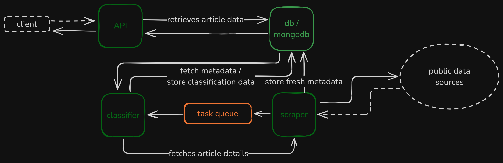

# news-board

A low distraction, personal news feed aggregator with sentiment based classification.

## Backend Architecture Overview

This backend is designed to fetch news periodically via web scraping and classify them in an event-driven manner.



### Monorepo service architecture

The project is being reorganized as a small monorepo with three services:

- API service: exposes REST endpoints and serves client-facing read operations
- Scraper service: discovers and publishes article events
- Classifier service: consumes queue events and stores classification results

The full architecture notes are in [docs/service-architecture.md](docs/service-architecture.md).

### Repository layout

```text
services/
├── api/
├── scraper/
└── classifier/
packages/
├── shared/
└── contracts/
```

### Run locally with Docker Compose

```bash
docker compose up --build
```

This starts:

- MongoDB on port 27017
- RabbitMQ on ports 5672 and 15672
- API on port 3000
- Scraper worker
- Classifier worker
