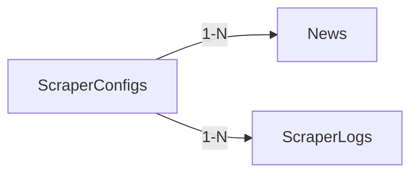

# Data Models

## Persistece Layer via MongoDB

Responsibilities:

- Long term data storage

#### pros

- Schema flexibility
- Scalability

### Access Patterns

The most frequent operation will be **reads** of article summary data from _**News**_ collection by the client or frontend, that consumes the API.

Article classifications (sentiment score, ...) will be read alongside the news summary data and written exactly once per article, so it could be embedded into _**News**_.

### Models

News.summay.title & artilceURL & description are required

```js
News {                      // scraped and classified articles
    _id ObjectId
    articleId String        // sha-256 hash of normalized url, deduplication key, unique
    source String           // nytimes
    url String              // normalized url
    originalUrl
    topic String            // tech
    isArchievable Boolean    // determines if record can be archived automatically

    status String           // scraped, classified, success, failed
    error String            // present if failed
    failedAt ISODate
    retryCount Number

    summary {
        title String
        description String
        imageUrl String
        readingTimeSeconds Int
    }

    scraperConfigId ObjectId

    classification {
        sentimentScore Number
    }

    publishedAt ISODate
    scrapedAt ISODate
    processedAt ISODate
}
```

```js
ArchivedArticles {          // archived/removed articles
    _id ObjectId
    articleId String        // same as in News, but not used by linking them
    url                     // normalized url
    reason                  // too_old, manual, low_quality
    archivedAt ISODate
}
```

```js
DailyStats {                // daily scraping result statistics
    _id ObjectId
    date ISODate
    discoveredArticlesByTopic [
        {
            topic String
            count Number
        }
    ]
    totalDiscovered Number
    createdAt ISODate
    updatedAt ISODate
}
```

```js
ScraperConfigs {            // scraper config store, worker pulls config from here, not from filesystem directly
    _id ObjectId
    name String
    isActive Boolean
    type String             // rss, api, scraper
    version Number          // for optimistic locking
    config {                // fetched and synched periodically from json file on file system

    }
    lastSyncedAt ISODate
    createdAt ISODate
    updatedAt ISODate
    deletedAt ISODate       // for soft delete
}
```

```js
ScraperLogs {                   // scraper job logs defined with buckets by day
    _id ObjectId
    scraperConfigId ObjectId    // index. Linking to ObjectId of ScraperConfigs
    bucketStart ISODate
    bucketEnd ISODate
    logs [
        timestamp ISODate
        level String            // info, warn, error
        message String
        articleUrl String
        durationMs Number
        error String           // if err
    ]
    count Number
    createdAt ISODate
    updatedAt ISODate
}

```

### Entity Relationships

Avoiding to establish relations between collections, because the more significant access patterns and MongoDB's embedding capability allows it.

Only the below models have linking between them, but are very infrequently accessed via $lookup.



## File System

The file system will be utilized for storing scraper configs as json files.

# Potential Improvements

## Implementing a Cache Layer via Redis

Responsibilities:

- Lighten database load by storing frequently accessed news data.
- Storing scraper configs, instead of reading them from database or at worst case, the file system.
- Supporting API request rate limiting (storage for RL algorithm)
