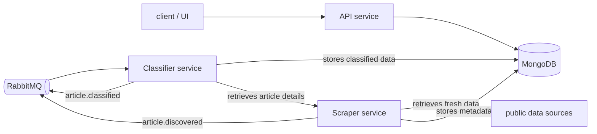

# Planned 3-service architecture for the news feed platform

## Target architecture

The app should be split into three independent Node.js + TypeScript services.

### 1. API service

Responsibilities:

- Expose REST endpoints for the client app.
- Read news items, classifications, and filters from MongoDB.
- Publish commands or requests when the client triggers an action.

### 2. Scraper service

Responsibilities:

- Run on a schedule or timer.
- Discover new articles from configured sources.
- Store raw article metadata in MongoDB.
- Publish events such as `article.discovered`.

This service owns the scraping pipeline and should not depend on the API layer.

### 3. Classifier service

Responsibilities:

- Consume queue events from the scraper service.
- Retrieve the relevant article metadata from MongoDB.
- Request additional article details from the scraper service.
- Analyze content and store classification results in MongoDB.
- Publish follow-up events such as `article.classified`.

This service should be fully asynchronous and should only communicate through the queue and the database.

## Architecture diagram



### Communication model

- The API service handles HTTP traffic and serves data from MongoDB.
- The scraper service runs on a schedule, stores discovered article metadata in MongoDB, and publishes `article.discovered` events to RabbitMQ.
- The classifier service consumes those events, fetches article details, analyzes content, and writes results back to MongoDB.
- The services communicate asynchronously through RabbitMQ, while MongoDB remains the shared source of truth for persisted article and classification state.

## Event-driven flow

### Async communication via RabbitMQ

#### pros

- It supports durable queues, retries, and dead-letter queues.
- It is a strong fit for event-driven workflows with multiple services.
- It integrates well with Node.js and Docker Compose.
- It is simpler to operate than Kafka for a project at this stage.

---

1. The scraper service discovers articles and stores them in MongoDB.
2. The scraper service publishes an event like:

```json
{
    "event": "article.discovered",
    "articleId": "123",
    "source": "nytimes",
    "url": "https://example.com/article"
}
```

3. The classifier service receives the event.
4. It fetches article details through the scraper service (or via a shared internal endpoint).
5. It analyzes the content and writes the classification result to MongoDB.
6. It publishes a second event such as:

```json
{
    "event": "article.classified",
    "articleId": "123",
    "label": "tech",
    "sentimentScore": 0.91
}
```

## Project repository organization

Project should be reorganized into a monorepo because the services share types, configuration, and infrastructure.

```text
repo-root/
├── services/
│   ├── api/
│   │   ├── src/
│   │   ├── package.json
│   │   └── tsconfig.json
│   ├── scraper/
│   │   ├── src/
│   │   ├── package.json
│   │   └── tsconfig.json
│   └── classifier/
│       ├── src/
│       ├── package.json
│       └── tsconfig.json
├── packages/
│   ├── shared/
│   │   └── src/
│   └── contracts/
│       └── src/
├── docker-compose.yaml
├── README.md
└── docs/
```

### Benefits of this layout

- Each service can be developed and deployed independently.
- Shared models and interfaces live in `packages/shared` and `packages/contracts`.
- Docker Compose can build each service from its own folder.
- Later on individual services can be scaled without affecting the others.

## Package boundaries

### Shared package

Use this package for:

- common config helpers
- logging utilities
- error types
- MongoDB connection helpers
- queue client wrappers

### Contracts package

Use this package for:

- event names
- message payload types
- DTOs shared across services

This avoids duplicated typing and helps keep the services compatible.
